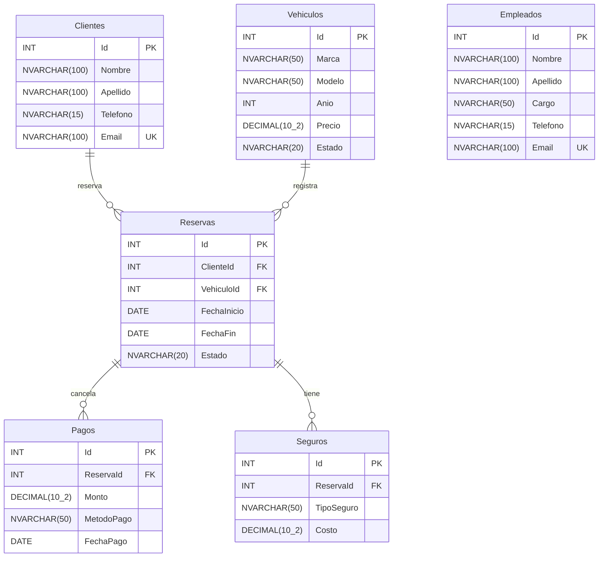

# 📜 Creación y Estructura de la Base de Datos

## Código SQL inicial

```sql
CREATE DATABASE AlquilerVehiculos;  
GO

USE AlquilerVehiculos;
GO

CREATE TABLE Vehiculos (      
    Id INT IDENTITY(1,1) PRIMARY KEY,      
    Marca NVARCHAR(50) NOT NULL,    
    Modelo NVARCHAR(50) NOT NULL,  
    Año INT NOT NULL, 
    Precio DECIMAL(10,2) NOT NULL,    
    Estado NVARCHAR(20) NOT NULL 
); 
   
CREATE TABLE Clientes ( 
    Id INT IDENTITY(1,1) PRIMARY KEY, 
    Nombre NVARCHAR(100) NOT NULL, 
    Apellido NVARCHAR(100) NOT NULL, 
    Telefono NVARCHAR(15) NOT NULL, 
    Email NVARCHAR(100) UNIQUE NOT NULL 
); 
   
CREATE TABLE Empleados ( 
    Id INT IDENTITY(1,1) PRIMARY KEY, 
    Nombre NVARCHAR(100) NOT NULL, 
    Apellido NVARCHAR(100) NOT NULL, 
    Cargo NVARCHAR(50) NOT NULL, 
    Telefono NVARCHAR(15) NOT NULL, 
    Email NVARCHAR(100) UNIQUE NOT NULL 
); 
   
CREATE TABLE Reservas ( 
    Id INT IDENTITY(1,1) PRIMARY KEY, 
    ClienteId INT FOREIGN KEY REFERENCES Clientes(Id), 
    VehiculoId INT FOREIGN KEY REFERENCES Vehiculos(Id), 
    FechaInicio DATE NOT NULL, 
    FechaFin DATE NOT NULL, 
    Estado NVARCHAR(20) NOT NULL 
); 
   
CREATE TABLE Pagos ( 
    Id INT IDENTITY(1,1) PRIMARY KEY, 
    ReservaId INT FOREIGN KEY REFERENCES Reservas(Id), 
    Monto DECIMAL(10,2) NOT NULL, 
    MetodoPago NVARCHAR(50) NOT NULL, 
    FechaPago DATE NOT NULL 
); 
   
CREATE TABLE Seguros ( 
    Id INT IDENTITY(1,1) PRIMARY KEY, 
    ReservaId INT FOREIGN KEY REFERENCES Reservas(Id), 
    TipoSeguro NVARCHAR(50) NOT NULL, 
    Costo DECIMAL(10,2) NOT NULL 
); 
```

## Modelo Entidad Relación

